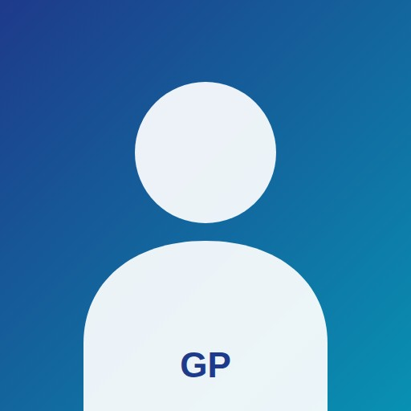

# 🚀 GUIA COMPLETO: CRIAR PORTFÓLIO NO GITHUB PAGES

**Versão:** 1.0  
**Data:** 14/07/2026

---

## 📋 PRÉ-REQUISITOS

Você precisa de:
- [x] Conta no GitHub (grátis em github.com)
- [x] Git instalado no seu computador
- [x] Editor de código (VS Code, Sublime, etc.) - opcional
- [x] Claude Code via terminal ou IDE

---

## ✅ PASSO 1: CRIAR REPOSITÓRIO NO GITHUB

### 1.1 Criar novo repositório
1. Acesse https://github.com/new
2. Nome do repositório: `gustavo-paccelli-portfolio` (ou seu-nome-portfolio)
3. Descrição: "Portfólio acadêmico-profissional"
4. Selecione: **Public** (para GitHub Pages funcionar)
5. Adicione `.gitignore` (Node.js ou Python, não importa)
6. Clique em **Create repository**

### 1.2 Clonar o repositório localmente
```bash
git clone https://github.com/SEU-USUARIO/gustavo-paccelli-portfolio.git
cd gustavo-paccelli-portfolio
```

---

## ✅ PASSO 2: CHAMAR CLAUDE CODE

### Opção A: Via Terminal (Claude Code)
```bash
claude --task "
Criar portfólio acadêmico-profissional em HTML5 + CSS3 + JavaScript seguindo 
EXATAMENTE as especificações do arquivo PORTFOLIO_PROMPT_CLAUDE_CODE.md. 

O portfólio deve ter 7 páginas (index, about, education, research, experience, 
certificates, contact) com 70+ certificados, 8 publicações, e todas as informações 
de Gustavo Paccelli da Costa.

Referência: PORTFOLIO_PROMPT_CLAUDE_CODE.md
"
```

### Opção B: Via VS Code + Claude Code Extension
1. Abra a pasta do projeto no VS Code
2. Pressione `Ctrl+Shift+P` (Windows/Linux) ou `Cmd+Shift+P` (Mac)
3. Digite: `Claude Code: Start Task`
4. Cole o prompt do arquivo `PORTFOLIO_PROMPT_CLAUDE_CODE.md`

### Opção C: Via Chat do Claude (claude.ai)
1. Abra https://claude.ai
2. Cole o conteúdo completo do arquivo `PORTFOLIO_PROMPT_CLAUDE_CODE.md`
3. Peça: "Crie todo o código HTML, CSS e JavaScript do meu portfólio baseado nestas especificações"
4. Copie os arquivos gerados para o seu repositório local

---

## ✅ PASSO 3: ESTRUTURAR PASTA DO PROJETO

Depois que Claude gerar os arquivos, organize assim:

```
gustavo-paccelli-portfolio/
├── index.html                    # Home
├── about.html                    # Sobre
├── education.html                # Educação
├── research.html                 # Pesquisa
├── experience.html               # Experiência
├── certificates.html             # Certificados
├── contact.html                  # Contato
│
├── css/
│   ├── style.css                # Estilos principais
│   └── responsive.css           # Media queries (opcional)
│
├── js/
│   ├── script.js                # Funcionalidades gerais
│   └── certificates.js          # Filtros de certificados
│
├── assets/
│   ├── img/
│   │   ├── perfil.jpg           # Sua foto (512x512px)
│   │   └── favicon.ico          # Ícone do site
│   │
│   └── docs/
│       ├── lattes.pdf           # CV Lattes completo
│       ├── cv-resumido.pdf      # CV em 2 páginas (opcional)
│       │
│       └── certificates/        # Pasta com 70+ PDFs
│           ├── 2025 Extraindo Informações do IBGE.pdf
│           ├── 2025 Avaliadores de Artigos Científicos.pdf
│           ├── 2024 Aprendizagem Baseada em Problemas.pdf
│           └── ... (mais 67 certificados)
│
├── README.md                     # Documentação do projeto
├── .gitignore                   # Arquivos a ignorar no Git
└── sitemap.xml                  # Mapa do site (para SEO)
```

---

## ✅ PASSO 4: ADICIONAR SEUS CERTIFICADOS

### 4.1 Copiar certificados
Copie todos os 70+ PDFs de certificados para a pasta:
```
assets/docs/certificates/
```

### 4.2 Atualizar certificates.html
O arquivo deve referenciar cada PDF assim:
```html
<a href="assets/docs/certificates/2025 Extraindo Informações do IBGE.pdf" target="_blank">
    📥 Download
</a>
```

**Dica:** Se Claude não incluir todos os 70 certificados automaticamente, você pode:
- Adicionar manualmente os cards em HTML
- Usar um script para gerar automaticamente (mais avançado)
- Pedir ao Claude para gerar um JSON com lista de certificados e JavaScript para renderizar

---

## ✅ PASSO 5: ADICIONAR SUA FOTO

1. Coloque uma **foto profissional alta resolução** (512x512px mínimo):
   ```
   assets/img/perfil.jpg
   ```

2. Certifique-se que está referenciada nos arquivos HTML:
   ```html
   
   ```

**Dica de foto:** Use um fundo neutro, roupa profissional, boa iluminação, tamanho do rosto adequado

---

## ✅ PASSO 6: TESTAR LOCALMENTE

### 6.1 Abrir no navegador localmente
**Opção A:** Clique duplo no `index.html`

**Opção B:** Use um servidor local (melhor opção)
```bash
# Com Python 3
python -m http.server 8000

# Com Node.js (http-server)
npx http-server

# Com VS Code Live Server (extensão)
# Clique direito > Open with Live Server
```

Acesse: `http://localhost:8000`

### 6.2 Verificar checklist
- [ ] Todos os links funcionam
- [ ] Páginas carregar corretamente
- [ ] Filtros de certificados funcionam
- [ ] Formulário de contato aparece
- [ ] Imagens carregam
- [ ] Responsivo em mobile/tablet/desktop
- [ ] Sem erros no console (F12)

---

## ✅ PASSO 7: FAZER COMMIT & PUSH

```bash
# Adicionar todos os arquivos
git add .

# Commit com mensagem descritiva
git commit -m "feat: criar portfólio acadêmico-profissional completo"

# Push para GitHub
git push origin main
```

---

## ✅ PASSO 8: ATIVAR GITHUB PAGES

1. Acesse seu repositório no GitHub
2. Vá para **Settings** (Configurações)
3. Na barra lateral, clique em **Pages** (sob "Code and automation")
4. Em "Build and deployment":
   - Source: Selecione **Deploy from a branch**
   - Branch: **main** (ou master)
   - Folder: **/ (root)**
5. Clique **Save**

GitHub Pages levará 1-2 minutos para processar.

---

## ✅ PASSO 9: ACESSAR SEU PORTFÓLIO

Seu portfólio estará disponível em:
```
https://SEU-USUARIO.github.io/gustavo-paccelli-portfolio/
```

Exemplo:
```
https://gustavopaccelli.github.io/gustavo-paccelli-portfolio/
```

---

## ✅ PASSO 10 (OPCIONAL): DOMÍNIO CUSTOMIZADO

### 10.1 Comprar um domínio
Opções: GoDaddy, Namecheap, Google Domains, etc.

**Sugestão de domínio:**
- `gustavopaccelli.com`
- `paccelli.dev`
- `gustavo-paccelli.com`

### 10.2 Configurar DNS
1. Em seu registrador de domínio, configure os DNS:
   ```
   A records para GitHub:
   185.199.108.153
   185.199.109.153
   185.199.110.153
   185.199.111.153
   ```

   OU use CNAME se o registrador permitir:
   ```
   SEU-USUARIO.github.io
   ```

2. No GitHub (Settings > Pages), em "Custom domain":
   - Digite seu domínio: `gustavopaccelli.com`
   - Clique **Save**

3. Aguarde o SSL/HTTPS ser configurado automaticamente (5-10 min)

**Resultado:**
```
https://gustavopaccelli.com/
```

---

## 🔒 OTIMIZAÇÕES FINAIS

### SEO Básico
Certifique-se que cada página tem:
```html
<meta name="description" content="Descrição concisa">
<meta name="keywords" content="gustavo, paccelli, sociologia, pesquisa">
<meta name="author" content="Gustavo Paccelli da Costa">
<meta property="og:title" content="Gustavo Paccelli - Pesquisador">
<meta property="og:image" content="https://seu-dominio.com/assets/img/perfil.jpg">
```

### Desempenho
- [ ] Imagens otimizadas (não >500KB cada)
- [ ] CSS e JS minificados
- [ ] Cache habilitado
- [ ] Google Analytics (opcional)

### Acessibilidade
- [ ] Alt text em todas imagens
- [ ] Links descritivos
- [ ] Contraste de cores adequado
- [ ] Navegação por teclado funciona

---

## 🐛 SOLUÇÃO DE PROBLEMAS

### Página não carrega após push
**Solução:** Aguarde 2-5 minutos, limpe cache do navegador (Ctrl+Shift+Del)

### CSS/JS não carregam
**Problema:** Caminhos relativos errados
**Solução:** Use `/` no início dos caminhos:
```html
<!-- ❌ Errado -->
<link rel="stylesheet" href="css/style.css">

<!-- ✅ Correto -->
<link rel="stylesheet" href="/gustavo-paccelli-portfolio/css/style.css">
```

### Certificados não aparecem
**Problema:** Arquivos não foram copiados para a pasta correta
**Solução:** 
1. Verifique se os PDFs estão em `assets/docs/certificates/`
2. Verifique se os nomes dos arquivos estão exatamente iguais no HTML

### Formulário de contato não funciona
**Problema:** Você precisará de um serviço externo para email
**Soluções:**
- Formspree.io (grátis, até 50 envios/mês)
- EmailJS (grátis)
- Google Forms (embutido)

---

## 📞 SUPORTE E PRÓXIMOS PASSOS

### Depois do lançamento
1. **Atualize constantemente:**
   - Adicione novas publicações
   - Atualize certificados
   - Revise conteúdo

2. **Compartilhe:**
   - LinkedIn
   - Email profissional
   - Lattes CNPq
   - Assinatura de email

3. **Monitore:**
   - Google Search Console
   - Google Analytics
   - Visitantes e engagement

---

## 🎯 CHECKLIST FINAL

- [ ] Repositório criado no GitHub
- [ ] Arquivos clonados localmente
- [ ] Claude Code gerou o código
- [ ] Pasta estruturada corretamente
- [ ] 70+ certificados copiados
- [ ] Foto profissional adicionada
- [ ] Testado localmente (sem erros)
- [ ] Commit e push feitos
- [ ] GitHub Pages ativado
- [ ] Portfólio acessível em `https://SEU-USUARIO.github.io/...`
- [ ] Links todos funcionam
- [ ] Responsivo verificado
- [ ] Domínio customizado (opcional)
- [ ] SEO básico implementado

---

## 📚 RECURSOS ÚTEIS

- [GitHub Pages Docs](https://docs.github.com/en/pages)
- [MDN HTML Reference](https://developer.mozilla.org/en-US/docs/Web/HTML)
- [CSS Tricks](https://css-tricks.com/)
- [Google Fonts](https://fonts.google.com/)
- [Unsplash Images](https://unsplash.com/) (fotos grátis)

---

**🎉 Parabéns! Seu portfólio está no ar!**

Próximos passos:
1. Compartilhe com professores, colegas, pesquisadores
2. Atualize com suas novas publicações
3. Considere adicionar um blog (opcional)
4. Monitore o tráfego com Google Analytics

---

**Dúvidas?** Veja o arquivo `PORTFOLIO_PROMPT_CLAUDE_CODE.md` para mais detalhes sobre as especificações técnicas.
